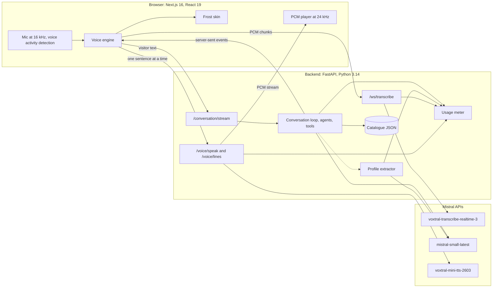
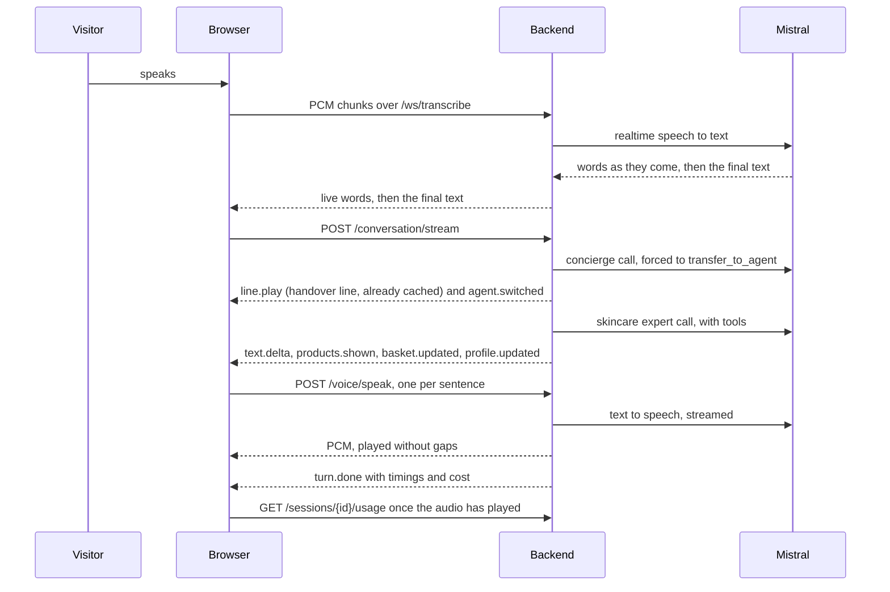

# Architecture V1

> Status: as built on 2026-10-05: V1 from `main` at commit `7ada306`, plus the journey of spec 006 on `feat/journey`. Owner: Thomas. The reasons behind each choice are in `specs/000-architecture/spec.md` and `context/decisions.md`; this file describes the system they produced.

## What V1 is

A visitor talks to a L'Oréal beauty advisor in the browser. A concierge greets them and hands over to a skincare expert, who asks a few questions, searches a catalogue of 13 real products, recommends one with two alternatives and says in one line why each suits the visitor, completes the routine, shows tutorials from the brands and creators, saves the visitor's profile with their consent, and prepares an email recap with an in-store offer. Replies are spoken; products, basket and customer record appear on screen as the conversation goes. Every model is Mistral's: Voxtral for speech in and out, Mistral Small for the agents.

What matters on the day, in order: it works every time, it answers fast, and every claim it speaks traces back to the catalogue.

## The system at a glance



## One turn, step by step



1. The browser listens all the time in hands-free mode. Voice activity detection opens one WebSocket per utterance and streams 16 kHz PCM; the visitor's words appear live.
2. 0.7 s of silence ends the utterance. The final text comes back about 0.2 s later, with its language detected locally.
3. The browser posts the text to `/conversation/stream` and reads server-sent events. The loop runs the active agent; on the first turn the concierge hands over, and the expert answers in the same turn.
4. The browser cuts the expert's streaming text into sentences and asks `/voice/speak` for each one, so the first sentence plays while the rest is still being written. Fixed lines (welcome, clarify, handover, search filler) are synthesised once at startup and fetched ahead.
5. Beside the turn, the profile extractor reads what the visitor said and fills the customer record.
6. `turn.done` closes the turn with per-stage timings and the session's cost so far.

Measured in the live golden run of 2026-10-04:

| Stage | English | French |
|---|---|---|
| Final transcript after the visitor stops | 0.19 s | 0.19 s |
| Concierge first token, handover line starts | 0.43 s | 0.41 s |
| First sound after the visitor stops | about 0.6 s | about 0.6 s |
| Expert's first words on screen | 0.77 s | 0.71 s |
| Cost of a first turn, audio included | €0.004 | €0.004 |

## Repository

```
AGENTS.md, CLAUDE.md   instructions for coding agents (CLAUDE.md imports AGENTS.md)
context/               read-only inputs and knowledge: brief, claims policy, decisions, lessons
specs/                 one folder per stream (000 to 003), plus v0/ and v1/ for versions
backend/               FastAPI app, catalogue data, tests, scripts (talk.py, make_test_audio.py)
frontend/              Next.js app: the live screen, its skin, the design templates, tests
spikes/                the 2026-10-04 experiments on speech to text, text to speech, chat engine
scripts/verify         one verdict for every check
.claude/               settings, the Stop hook, project skills
```

## Backend

The loop knows nothing about beauty. Brands, products and profiles live in agent configurations, tools and observers; agents are configurations that the loop switches between.

| Method | Path | Purpose |
|---|---|---|
| POST | `/sessions` | New session: id, first agent, language, welcome line |
| DELETE | `/sessions/{id}` | End a session and drop its state |
| GET | `/sessions/{id}/usage` | Running cost in euros, with tokens, seconds and characters |
| WS | `/ws/transcribe` | Browser PCM in; live words and the final text out (`language`, `session_id`) |
| POST | `/conversation/stream` | One turn as server-sent events |
| POST | `/voice/speak` | One sentence as streamed PCM in the agent's voice |
| GET | `/voice/lines/{agent}/{line}/{language}` | A fixed line, synthesised at startup |
| GET | `/config` | Agents, their names and role labels in both languages, line texts |
| POST | `/turns/{turn_id}/timings` | The browser's timings, logged next to the backend's |
| GET | `/health` | Liveness, and whether the Mistral key is set |

| Module (`backend/app/`) | Role |
|---|---|
| `conversation/loop.py` | One turn: model calls with tools, the agent switch, at most 3 tool rounds, observers, events |
| `conversation/mistral_stream.py` | Streaming with a first-token deadline, one retry, then the fallback model; reads token usage |
| `conversation/session.py` | In-memory sessions (30 minutes): history, active agent, profile, basket, usage |
| `conversation/events.py` | The event models sent to the browser |
| `agents/` | The concierge and skincare configurations, prompts, fixed lines, voices |
| `tools/` | `transfer_to_agent`, `search_products`, `get_routine`, `add_to_basket`, `save_profile` |
| `catalogue/` | Product schema, store, ranking, and `data/products.json` |
| `profile/` | Beauty profile, merge rules, and the extractor that runs beside each turn |
| `voice/` | Speech-to-text bridge, text to speech with hedged requests, the fixed-line cache |
| `usage/` | The per-session meter and the euro price table |
| `settings.py` | Every model id, timeout and limit, overridable from `.env` |

## Agents

| Agent | Name on screen (EN, FR) | Role label | Voice | Tools | How it calls them |
|---|---|---|---|---|---|
| `concierge` | Beauty concierge, Concierge beauté | Welcome, Accueil | gb_oliver_cheerful | `transfer_to_agent` | Forced on every call: it never writes free text |
| `skincare` | Skincare expert, Experte soin | Skincare, Soin | gb_jane_confident | `search_products`, `get_routine`, `add_to_basket`, `save_profile`, `show_tutorials`, `send_recap` | The model chooses; a search is forced after 4 expert turns without one |

The handover happens in code. The concierge's call is forced to `transfer_to_agent` with the specialist and a one-line summary of the need; the loop removes that call from the history, plays the concierge's fixed handover line, switches agent and runs the expert in the same turn. When the need is still unclear, the tool plays the clarify line once instead. At Decathlon, handovers left to the model misfired on about 30% of first turns and cost 2 to 3 s.

Each turn, the active agent gets its stable instructions first, then the history, then a short context block (reply language, the concierge's summary, the profile so far, the basket, the products already shown) right before the visitor's latest message. Everything before the context block stays identical from turn to turn, so Mistral's prompt cache serves it.

## Tools

| Tool | Agent | What it does | Screen event |
|---|---|---|---|
| `transfer_to_agent` | concierge | Hands over to `skincare` with a summary, or flags the need as unclear | `line.play`, `agent.switched` |
| `search_products` | skincare | Filters and ranks the catalogue for the profile; up to three products, best match first, with their approved claims and usage notes in the session language | `products.shown` |
| `get_routine` | skincare | The products that pair with one, by routine step | `products.shown` |
| `add_to_basket` | skincare | Adds products; returns the items and the total | `basket.updated` |
| `save_profile` | skincare | Keeps the profile with consent (and the first name), or discards it | `profile.updated` |
| `show_tutorials` | skincare | Up to four verified videos from the brands and creators for the basket's products | `tutorials.shown` |
| `send_recap` | skincare | Reads the address back, then, once confirmed, writes the recap with an example in-store coupon; the address stays masked | `profile.updated`, `recap.ready` |

## Models

| Use | Model | Settings |
|---|---|---|
| Speech to text | `voxtral-transcribe-realtime-3` | Realtime WebSocket, 16 kHz mono PCM; brand names biased through `context_bias`; language detected locally on the final text |
| Agents | `mistral-small-latest` (Mistral Small 4) | Temperature 0.3; first token within 2.5 s, else one retry, then `mistral-medium-latest` |
| Profile extractor | `mistral-small-latest` | Structured output, temperature 0, runs beside the turn with a 3 s budget |
| Text to speech | `voxtral-mini-tts-2603` | Streamed float32 PCM at 24 kHz; a second request races the first after 0.9 s, up to 3 attempts of 5 s |
| Recap writer | `mistral-small-latest` | Structured output, temperature 0.3, 6 s budget; checked against the approved claims, else a template writes it |
| Test judge | `mistral-medium-latest` | Golden tests only: one verdict per spoken sentence against the approved claims |

Voices are presets from the text-to-speech spike, the same voice for English and French; Thomas has not confirmed them yet (`backend/app/agents/voices.py`).

## How it stays fast

- One loop with function tools and a handover in code: no extra model call to decide who answers.
- The first sentence is spoken while the rest is still being written: text to speech runs per sentence.
- Fixed lines are synthesised at startup and fetched ahead, so the handover line plays at once.
- Hedged text to speech: when the first chunk is slow, a second request races it.
- A first-token deadline with a retry and a fallback model on the agent calls.
- A cacheable prompt prefix (the context block sits right before the latest message).
- At most 3 tool rounds per turn; the profile extractor runs in parallel and never delays the reply.
- Every stage is timed and carried in `turn.done`; the header shows the average reply time and p90.

## Language

English by default. When the visitor switches to French, the final transcript's detected language becomes the session language: the next reply, the claims quoted, the screen labels and the voice follow, and they follow back to English the same way.

## Claims and safety

- The catalogue holds approved claims quoted word for word from each brand's UK page (English) and French page (French), with the source URL and the date copied (`context/claims-policy.md`, `specs/002-discovery/perimeter.md`). For pages that block bots, the text came from retailer or search copies of the brand's wording, never from a model; Thomas checks those before the event.
- Tools return only those claims, and the expert describes a product only with them.
- No medical wording. When the visitor names a skin condition or asks for a cure, a note in the turn context makes the expert say it can't give medical advice and name a pharmacist or a dermatologist.
- No other company's products, even when the visitor names one.
- Spoken replies are two or three short sentences of plain text; prices, specs and lists stay on screen.
- The golden tests replay demo conversations against the live models and have a second model check every spoken sentence against the approved claims.

## Profile and customer record

- Fields: first name, email (masked), language, skin type, concerns, sensitivity, texture preference, budget band, routine size, fragrance-free preference, hair type and hair concerns, consent.
- The extractor records a concern only when the visitor names it: asking for a moisturiser does not mean hydration, and tightness sets the skin type.
- Merge rules: known values overwrite, lists grow without duplicates, consent and language never change through extraction, a declined profile never changes again.
- Consent comes only from `save_profile`. Events from observers are rebuilt when they are sent, so the record never falls back to "pending" after the visitor agreed.
- The email is captured only after consent, read back before use, masked on screen, in events and in logs, and never sent: the recap is a preview.
- Nothing outlives the session. Visitor audio stays in memory; logs hold timings and text transcripts only.

## Running cost

The backend meters every session: tokens per model (including fallbacks and the extractor), speech-to-text seconds counted from the audio bytes forwarded, and text-to-speech characters for every attempt started. `turn.done` carries the total so far, and the browser fetches `GET /sessions/{id}/usage` once the turn's audio has played, so the speech it just heard is included.

| Model | Price used (EUR) | Source |
|---|---|---|
| `mistral-small-latest` | 0.12 in, 0.50 out per million tokens | mistral.ai/pricing, 2026-10-04 |
| `mistral-medium-latest` | 1.25 in, 6.40 out per million tokens | same |
| `voxtral-mini-tts-2603` | 0.01 per 1,000 characters | same (shown beside 0.016 USD) |
| `voxtral-transcribe-realtime-3` | 0.0053 per minute | Not on the public list: the listed realtime model's price, chosen by Thomas on 2026-10-05 |

## Events from backend to browser

| Event | Carries |
|---|---|
| `turn.started` | agent, language |
| `text.delta` | agent, a piece of the reply |
| `tool.started`, `tool.finished` | tool name, arguments, success, duration |
| `line.play` | a fixed line to play (handover, clarify, search filler) |
| `agent.switched` | from and to agent |
| `products.shown` | products with claims, best match |
| `basket.updated` | items, total |
| `profile.updated` | the whole profile, the email masked |
| `tutorials.shown` | the videos: platform, creator, brand or creator account, title, link |
| `recap.ready` | masked address, subject, body, coupon (code, label, valid until) |
| `turn.done` | timings per model call and tool, total, `cost_eur` |
| `error` | message, whether the conversation can go on |

The browser parses the same event set (`frontend/src/lib/events.ts`); a contract test keeps one example of every event in a fixture both sides read.

## Frontend

| Path (`frontend/src/`) | Role |
|---|---|
| `app/page.tsx` | The live screen at `/`; `?mock=1` plays the scripted conversation, `?camera=1` shows the camera switch |
| `components/app/Screen.tsx` | `LiveScreen` (the voice engine) or `MockScreen` (the script), both rendering the skin |
| `hooks/useScreenAgent.ts` | Adapts either source to `ScreenAgent`: the conversation state plus restart and camera |
| `skins/types.ts`, `skins/frost/` | The skin contract and the first skin; every component takes `{ agent }` |
| `lib/voice-engine.ts` | Mic, voice activity detection, utterances, the turn stream, sentence-by-sentence speech, stats |
| `lib/mic.ts`, `lib/utterance.ts`, `lib/pcm-player.ts` | Capture at 16 kHz, one WebSocket per utterance, gapless playback at 24 kHz |
| `lib/api.ts`, `lib/events.ts`, `lib/voice-agent.ts` | Backend calls, the event types, the state the screen reads |
| `components/i18n.ts` | Every label in English and French, and price, time and cost formats |
| `dev/mockVoiceAgent.ts` | The scripted golden path, about 71 s with tutorials and the recap, for rehearsal and browser tests |
| `templates/`, `app/templates/` | The ten design templates of the two review rounds, kept for reference |

The voice engine:
- Hands-free by default: an RMS threshold of 0.012 opens an utterance after 2 loud frames of 64 ms, keeps 5 frames of pre-roll, and closes after 700 ms of silence (20 s at most). Hold to talk works with the button or the space bar.
- Half duplex: the mic is ignored while the agent speaks, with a 300 ms guard after it stops.
- A reply is cut into sentences of at least 20 characters; each sentence is spoken as soon as it is complete.
- Reply time runs from the end of the visitor's speech to the first sound; the header shows the average and p90 over the conversation.
- Restart ends the session and returns to the welcome screen for the next visitor.

Skins receive the agent as a prop, so a template can become a skin without touching the engine. The live screen uses one skin today, `frost`.

## Design system: the Frost skin

Chosen by Thomas after two rounds of templates: Frost's look with Lumen's agent labels and relay (`context/decisions.md`, screen and interface).

| Token | Value | Use |
|---|---|---|
| Ink | #0B0B0C | Text, pills, the capsule, the top-pick card |
| Text 2 | #2C2F34 | Visitor lines once final |
| Muted | #6B7079 | Secondary text and labels |
| Quiet | #A3A8B0 | Empty states, "not captured yet" |
| Partial | #7D828B | The visitor's words while they speak |
| Surface | #F5F6F7 | Side panel, image wells |
| Bubble | #F1F2F4 | Visitor bubbles |
| Track | #E3E5E8 | Switches and tracks |
| Yellow | #FFD23F | The voice: waveform, agent dots, live states, top pick, captured fields |

- Type: Geist only. Sizes come from `fs(px)`, the Frost template's sizes at 80% and never below 13 px: agent lines 25 px, visitor lines 19 px, labels 13 px.
- Shapes: pills (fully rounded), cards with a 24 px radius, image wells with 14 to 16 px, one soft shadow. No grid patterns, no square-heavy shapes, no coloured bar on the side of cards, no monospace, no beige.
- Motion: CSS keyframes prefixed `fr-` (entry, pop, waveform speak, listen and think, ring, flash, pulse, breathe); reduced motion is respected.
- Layout: 1920×1080 first. The conversation takes three quarters on the left, under a header with the wordmark, average reply, p90, cost and Restart; the right quarter holds the basket and the customer record.
- Components: the welcome screen; the black capsule with the agent's role, icon and yellow waveform, which widens at each handover; the relay steps ("Welcome > Skincare"); agent lines with a small yellow dot before the role; visitor bubbles; product carousels inside the transcript with the top pick in black; the talk bar; the basket; the "For you" line on product cards; the tutorial cards with QR codes; the recap preview with its coupon and QR code; the customer record with its "n of 10" counter and the consent line; the camera panel for V2.
- Text on screen: sentence case, never all caps, labels in the conversation's language.

## Tests and checks

| Command | Adds | Count on 2026-10-05 |
|---|---|---|
| `scripts/verify --quick` | Repo rules, ruff, backend unit tests, eslint, TypeScript, frontend unit tests | 290 backend, 21 frontend |
| `scripts/verify` | The production build and the browser test of the scripted conversation (system Chrome, Playwright) | 2 browser tests |
| `scripts/verify --golden` | The live API: real speech in and out in English and French, the five golden conversations of spec 002, and live audio in Chrome through a fake microphone | 7 backend, 1 browser |

The Stop hook runs the quick checks after every agent turn that changed files. The live audio browser test needs macOS microphone permission for the terminal that launches Chrome.

## Running it

From the repo root, per the README:
- Backend: `cd backend && uv run uvicorn app.main:app --port 8000`
- Frontend: `cd frontend && npm run build && npx next start -p 3100`
- Live: http://localhost:3100/ (headphones, or hold to talk). Scripted: http://localhost:3100/?mock=1.
- Terminal only: `cd backend && uv run python scripts/talk.py --mode ptt`.

## Known limits

- When speech to text closes a sentence while the visitor is still talking, the engine shows what it heard and keeps listening on a new socket; it answers after the visitor's own 0.7 s of silence (only a live run exercises this).
- Sessions live in the memory of one backend process: a restart ends every conversation.
- Voices are not final, and the claims taken from secondary sources need Thomas's check.

## Next

- The haircare expert (spec 002 extended), presenter controls and reset between volunteers (spec 005), the camera (spec 004, V2; its slot is already in the screen).

## Read more

- Decisions and why: `specs/000-architecture/spec.md`, `context/decisions.md`
- Streams: `specs/001-voice-core/spec.md`, `specs/002-discovery/spec.md`, `specs/003-journey-ui/spec.md`
- Lessons from the build: `context/build-lessons.md`, `context/voice-lessons.md`
