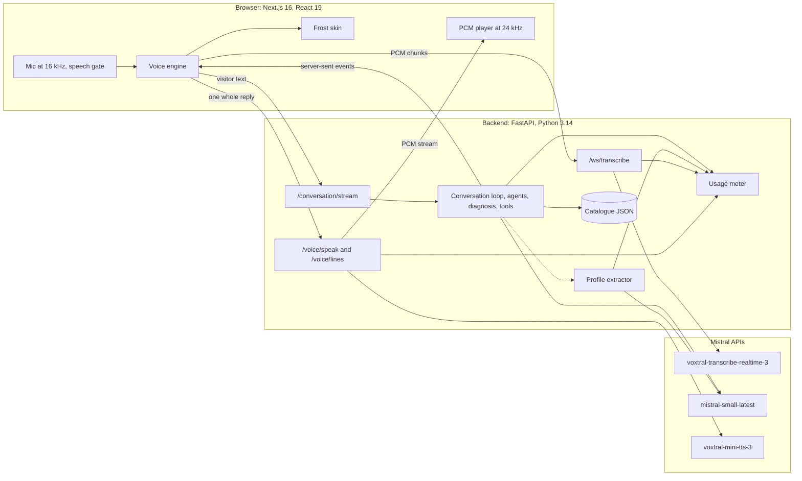

# Architecture v2

> Status: as built at commit `0888b10` on `main`, 2026-10-06, the demo-ready version, with the routine in code, the fuller record and the closing invitation added the same day; the tag `v2` holds them and the rest of that day's work (`context/handover.md`). Owner: Thomas. The reasons behind each choice are in `specs/000-architecture/spec.md` and `context/decisions.md`; what changed since V1, the risks and the state of the repo are in `context/handover.md`. V1 as built: `git show 50b09fe:specs/v1/architecture.md`.

## What v2 is

A visitor talks to a L'Oréal beauty advisor in the browser. A concierge greets them and hands over to a skincare expert. The expert runs the same diagnosis every time (the product sought when unnamed, skin type, redness, what they would most like to improve, the moisturiser they use now and how they find it, texture, age range, each skipped once answered), searches a catalogue of 13 real products, recommends one with two alternatives and one line on why each suits the visitor, completes the routine with one cleanser in code, shows the routine's tutorials from the brands and creators, asks about hair, saves the profile with consent, and prepares an email recap with an example in-store offer from the address typed on screen. Each reply is spoken in one take; products, basket, customer record, reply times and cost appear on screen as the conversation goes. Every model is Mistral's: Voxtral for speech in and out, Mistral Small for the agents.

What matters on the day, in order: it works every time, it answers fast, and every claim it speaks traces back to the catalogue.

## The system at a glance



## One turn, step by step

```mermaid
sequenceDiagram
  participant V as Visitor
  participant B as Browser
  participant S as Backend
  participant M as Mistral
  V->>B: speaks
  B->>S: PCM chunks over /ws/transcribe
  S->>M: realtime speech to text
  S-->>B: live words, then the final text
  B->>S: POST /conversation/stream
  Note over S: first turn only: the concierge's call is forced to transfer_to_agent,<br/>then line.play (handover line) and agent.switched
  alt diagnosis still open
    S->>M: expert call with no tools, the context naming one topic
    Note over S: reply checked; a fixed question replaces one that strays
  else diagnosis complete
    S->>M: expert call forced to search_products, then a call that presents the top pick
    S-->>B: products.shown
  end
  S-->>B: text.done with the whole reply
  B->>S: POST /voice/speak with that reply
  S->>M: text to speech, two requests racing
  S-->>B: PCM, played without gaps
  S-->>B: profile.updated, then turn.done with timings and cost
  B->>S: GET /sessions/{id}/usage once the audio has played
```

1. The browser listens all the time in hands-free mode. Two loud frames start the visitor's line and open a WebSocket; the visitor's words appear live.
2. After 0.45 s of silence the socket ends, so its final text is back when 0.7 s of silence ends the line; speech in between resumes the line on a new socket. The language is detected locally on the final text.
3. The browser posts the text to `/conversation/stream` and reads server-sent events. On the first turn the concierge hands over and the expert answers in the same turn.
4. When a model call's text is complete, the backend sends `text.done`, before any tool runs and before the turn waits for the profile extractor. The browser shows that text and asks `/voice/speak` for all of it in one request, so the voice keeps one intonation.
5. Beside the turn, the profile extractor reads the exchange and fills the customer record.
6. `turn.done` closes the turn with per-stage timings and the session's cost so far.

Measured on 2026-10-05:

| Stage | Value |
|---|---|
| From the visitor's last word to the final text, hands-free | 0.70 to 0.76 s in the real-audio browser test (0.91 s before the socket ended at 0.45 s) |
| Handover turn: first sound, the concierge's fixed line | about 1.3 s after the last word |
| Expert turn after the handover: reply text complete | median 1.7 s after the request (9 turns, most with a search) |
| Speech service: first audio of a whole reply | median 0.45 s; the same for three sentences as for one |
| A sentence-by-sentence start would have been | about 0.2 s sooner, with the intonation reset at every sentence |

## Repository

```
AGENTS.md, CLAUDE.md   instructions for coding agents (CLAUDE.md imports AGENTS.md)
context/               inputs and knowledge: brief, claims policy, decisions, lessons, handover
specs/                 one folder per stream (000 to 003, 006), plus v0/ and v2/ for versions
backlog.md             fixes, cleanup, ideas and refactoring found but not scheduled
backend/               FastAPI app, catalogue data, tests, scripts (talk.py, make_test_audio.py)
frontend/              Next.js app: the live screen, its skin, design templates and mockups, tests
spikes/                the 2026-10-04 experiments on speech to text, text to speech, chat engine
scripts/verify         one verdict for every check
.claude/               settings, the Stop hook, project skills; worktrees/ for parallel streams (ignored)
```

## Backend

The loop knows nothing about beauty. Brands, products, profiles and the diagnosis live in agent configurations, tools and observers; agents are configurations that the loop switches between.

| Method | Path | Purpose |
|---|---|---|
| POST | `/sessions` | New session: id, first agent, language, welcome line |
| DELETE | `/sessions/{id}` | End a session and drop its state |
| GET | `/sessions/{id}/usage` | Running cost in euros, with tokens, seconds and characters |
| POST | `/sessions/{id}/recap` | The email recap from the address the visitor typed, as `profile.updated` and `recap.ready` events |
| WS | `/ws/transcribe` | Browser PCM in; live words and the final text out (`language`, `session_id`) |
| POST | `/conversation/stream` | One turn as server-sent events |
| POST | `/voice/speak` | One reply (up to 2,000 characters) as streamed PCM in the agent's voice |
| GET | `/voice/lines/{agent}/{line}/{language}` | A fixed line, synthesised at startup |
| GET | `/config` | Agents, their names and role labels in both languages, line texts |
| POST | `/turns/{turn_id}/timings` | The browser's timings, logged next to the backend's |
| GET | `/health` | Liveness, and whether the Mistral key is set |

| Module (`backend/app/`) | Role |
|---|---|
| `conversation/loop.py` | One turn: model calls with tools, the agent switch, at most 3 tool rounds, `text.done` per call, observers, events. A call whose agent allows no tool is sent no tools. A text-only reply goes through the agent's `vet_reply` before it is spoken. A reply that promises an action before any tool ran is followed by a call that must use one |
| `conversation/mistral_stream.py` | Streaming with a first-token deadline, one retry, then the fallback model; reads token usage |
| `conversation/session.py` | In-memory sessions (30 minutes): history, active agent, profile, basket, usage, flags |
| `conversation/events.py` | The event models sent to the browser |
| `agents/` | The concierge and skincare configurations, prompts, fixed lines, voices. The journey's steps in code: `diagnosis.py` (the seven topics, their words in English and French, the per-session state), `routine.py` (the product that completes the routine, the visitor's yes or no, the tutorials), `hair.py` (the hair bridge); `wording.py` holds what the reply checks share |
| `tools/` | `transfer_to_agent`, `search_products`, `get_routine`, `add_to_basket`, `save_profile`, `show_tutorials` |
| `recap/` | The recap from the typed address: facts, writer, check, template, coupon, email masking |
| `catalogue/` | Product schema, store, ranking (the age range nudges it), fit sentences, and `data/products.json` |
| `profile/` | Beauty profile, merge rules, and the extractor that runs beside each turn |
| `voice/` | Speech-to-text bridge, text to speech with racing requests and leading-silence trimming, the fixed-line cache |
| `usage/` | The per-session meter and the euro price table |
| `main.py` | The app, and one Mistral client over an HTTP pool that keeps idle connections 300 s |
| `settings.py` | Every model id, timeout and limit, overridable from `.env` |

## Agents

| Agent | Name on screen (EN, FR) | Role label | Voice | Tools | How it calls them |
|---|---|---|---|---|---|
| `concierge` | Beauty concierge, Concierge beauté | Welcome, Accueil | gb_oliver_cheerful | `transfer_to_agent` | Forced on every call: it never writes free text |
| `skincare` | Skincare expert, Experte soin | Skincare, Soin | gb_jane_neutral | `search_products`, `get_routine`, `add_to_basket`, `save_profile`, `show_tutorials` | None during the diagnosis; `search_products` forced when it completes (or after 8 expert turns); after the visitor's choice, the routine's steps in code (`get_routine` forced, then `add_to_basket` on a yes and `show_tutorials`), then the hair bridge's; otherwise the model chooses |

The handover happens in code. The concierge's call is forced to `transfer_to_agent` with the specialist and a one-line summary of the need; the loop removes that call from the history, plays the concierge's fixed handover line, switches agent and runs the expert in the same turn. The browser leaves 1.2 s after the handover line before the expert speaks. When the need is still unclear, the tool plays the clarify line once instead. At Decathlon, handovers left to the model misfired on about 30% of first turns and cost 2 to 3 s.

The diagnosis runs in code, the same way every time (spec 002, Diagnosis):
- Topics in order: skin type, redness, the moisturiser used now and how they find it (product feedback), texture, age range (optional). A topic is answered when the visitor's words mention it, when the profile holds it, or when the expert asked it and the visitor replied with anything but a question; a question gets the topic asked again once.
- Each diagnosis turn, the context block names the one topic, the call carries no tools, and the reply is checked before it is spoken (one question, on its topic, at most 60 words, no product, brand or tool name); otherwise the topic's fixed question replaces it, in the visitor's language.
- The turn the last topic is answered, `search_products` is forced and the expert presents its top pick in that same turn.

Each turn, the active agent gets its stable instructions first, then the history, then a short context block (reply language, the concierge's summary, the profile so far, the basket, the products already shown, and the notes that apply: diagnosis topic, the routine's step, the hair bridge's step, medical referral, email typed on screen, recap shown) right before the visitor's latest message. Everything before the context block stays identical from turn to turn, so Mistral's prompt cache serves it.

## Tools

| Tool | Agent | What it does | Screen event |
|---|---|---|---|
| `transfer_to_agent` | concierge | Hands over to `skincare` with a summary, or flags the need as unclear | `line.play`, `agent.switched` |
| `search_products` | skincare | Filters and ranks the catalogue for the visitor (skin type, concerns, sensitivity, texture, budget, age range); up to three products, best match first, with their approved claims, usage notes and fit sentence in the session language | `products.shown` |
| `get_routine` | skincare | The one product that completes the routine around the first skin choice (for a cream, the cleanser for the visitor's skin; `app/catalogue/pairing.py`) | `products.shown` |
| `add_to_basket` | skincare | Adds products; returns the items and the total | `basket.updated` |
| `save_profile` | skincare | Keeps the profile with consent (and the first name), or discards it | `profile.updated` |
| `show_tutorials` | skincare | Up to four verified videos from the brands and creators for the basket's products | `tutorials.shown` |

The email recap is no tool. After consent the visitor types the address in a field on screen, and `POST /sessions/{id}/recap` writes the recap with an example in-store coupon and returns the same `profile.updated` and `recap.ready` events, so no model decision stands between the address and the recap. The expert only points at the field.

## Models

| Use | Model | Settings |
|---|---|---|
| Speech to text | `voxtral-transcribe-realtime-3` | Realtime WebSocket, 16 kHz mono PCM; brand names biased through `context_bias`; language detected locally on the final text |
| Agents | `mistral-small-latest` (Mistral Small 4) | Temperature 0.3; first token within 2.5 s, else one retry, then `mistral-medium-latest` |
| Profile extractor | `mistral-small-latest` | Structured output, temperature 0, runs beside the turn with a 3 s budget; budget and age banded in code |
| Text to speech | `voxtral-mini-tts-3` | Streamed float32 PCM at 24 kHz, one request per reply; two requests race from the start, a third after 0.9 s, each with 5 s for its first chunk, 200 ms before replacing one that failed; leading silence trimmed (about 255 ms on this model) |
| Recap writer | `mistral-small-latest` | Structured output, temperature 0.3, 6 s budget; checked against the approved claims, else a template writes it |
| Test judge | `mistral-medium-latest` | Golden tests only: one verdict per spoken sentence against the approved claims |

Voices are presets, the same voice for English and French (`backend/app/agents/voices.py`): Oliver Cheerful for the concierge, and Jane Neutral for the expert, which Thomas picked by ear on 2026-10-05. The fixed lines are synthesised at startup without the racing start, to keep the startup burst small.

## How it stays fast

- One loop with function tools and a handover in code: no extra model call to decide who answers.
- The transcription socket ends at 0.45 s of silence, so the final text is ready when the turn opens at 0.7 s.
- Fixed lines are synthesised at startup and fetched ahead, so the handover line and the search filler play at once.
- Raced text to speech: two requests start together and the first to deliver audio wins.
- The Mistral client keeps its connections open between turns.
- A first-token deadline with a retry and a fallback model on the agent calls.
- A cacheable prompt prefix (the context block sits right before the latest message).
- At most 3 tool rounds per turn; the profile extractor runs in parallel and never delays the reply.
- Every stage is timed and carried in `turn.done`; the screen shows the average reply time and p90.

## Language

English by default. When the visitor switches to French, the final transcript's detected language becomes the session language: the next reply, the claims quoted, the screen labels, the fixed questions and the voice follow, and they follow back to English the same way.

## Claims and safety

- The catalogue holds approved claims quoted word for word from each brand's UK page (English) and French page (French), with the source URL and the date copied (`context/claims-policy.md`, `specs/002-discovery/perimeter.md`). For pages that block bots, the text came from retailer or search copies of the brand's wording, never from a model; Thomas checks those before the event.
- Tools return only those claims, and the expert describes a product only with them, word for word.
- Diagnosis replies are checked before they are spoken, so no product is named before the search. In the turn of a search, the reply must present the screen's top pick first; otherwise the top pick's fixed presentation replaces it (its name, fit line and an approved claim word for word).
- No medical wording. When the visitor names a skin condition or asks for a cure, a note in the turn context makes the expert say it can't give medical advice and name a pharmacist or a dermatologist.
- No other company's products aloud. When the visitor says they use one, the expert thanks them and moves on; when they ask about one, it says it can only advise on L'Oréal Groupe products. The record still keeps the brand they named, for the brands' marketing teams.
- Spoken replies are two or three short sentences of plain text; prices, specs and lists stay on screen.
- The golden tests replay demo conversations against the live models and have a second model check every spoken sentence against the approved claims.

## Profile and customer record

- Fields: first name, email (masked), language, age range (`under_30`, `30s`, `40s`, `50s`, `60_plus`), skin type, concerns, sensitivity, texture preference, budget band, routine size, fragrance-free preference, hair type and hair concerns, product feedback (brand as said, product, liked, disliked or mixed, and the reason in the visitor's words, for each product they use), consent. Gender is neither asked nor inferred.
- The record on screen has twelve rows and a "n of 12" counter.
- The extractor records a concern only when the visitor names it: asking for a moisturiser does not mean hydration, and tightness sets the skin type.
- Merge rules: known values overwrite, lists grow without duplicates, consent and language never change through extraction, a declined profile never changes again.
- Consent comes only from `save_profile`. Events from observers are rebuilt when they are sent, so the record never falls back to "pending" after the visitor agreed.
- The email is typed on screen, only after consent; it is masked in the profile, on screen, in events and in logs, and never sent: the recap is a preview.
- Nothing outlives the session. Visitor audio stays in memory; logs hold timings and text transcripts only.

## Running cost

The backend meters every session: tokens per model (including fallbacks and the extractor), speech-to-text seconds counted from the audio bytes forwarded, and text-to-speech characters for every request started, racing ones included. `turn.done` carries the total so far, and the browser fetches `GET /sessions/{id}/usage` once the turn's audio has played, so the speech it just heard is included. A full conversation costs a few cents, most of it speech: the racing requests bill each reply twice.

| Model | Price used (EUR) | Source |
|---|---|---|
| `mistral-small-latest` | 0.12 in, 0.50 out per million tokens | mistral.ai/pricing, 2026-10-04 |
| `mistral-medium-latest` | 1.25 in, 6.40 out per million tokens | same |
| `voxtral-mini-tts-3` | 0.01 per 1,000 characters | Assumed equal to `voxtral-mini-tts-2603`'s listed price; to confirm |
| `voxtral-transcribe-realtime-3` | 0.0053 per minute | Not on the public list: the listed realtime model's price, chosen by Thomas on 2026-10-05 |

## Events from backend to browser

| Event | Carries |
|---|---|
| `turn.started` | agent, language |
| `text.delta` | agent, a piece of the reply |
| `text.done` | agent, a model call's whole text, sent before its tools run: what the browser shows and speaks |
| `tool.started`, `tool.finished` | tool name, arguments, success, duration |
| `line.play` | a fixed line to play (handover, clarify, search filler) |
| `agent.switched` | from and to agent |
| `products.shown` | products with claims, usage notes and fit, best match |
| `basket.updated` | items, total |
| `profile.updated` | the whole profile, the email masked |
| `tutorials.shown` | the videos: platform, creator, brand or creator account, title, link |
| `recap.ready` | masked address, subject, body, coupon (code, label, valid until) |
| `turn.done` | timings per model call and tool, total, `cost_eur` |
| `error` | message, whether the conversation can go on |

The browser parses the same event set (`frontend/src/lib/events.ts`); a contract test keeps one example of every event in a fixture both sides read.

## Frontend

| Path (`frontend/src/`) | Role |
|---|---|
| `app/page.tsx` | The live screen at `/`; `?mock=1` plays the scripted conversation, `?camera=1` shows the camera switch, `?autostart=1` skips the welcome |
| `components/app/Screen.tsx` | `LiveScreen` (the voice engine) or `MockScreen` (the script), both rendering the skin |
| `hooks/useScreenAgent.ts` | Adapts either source to `ScreenAgent`: the conversation state plus restart and camera |
| `skins/types.ts`, `skins/frost/` | The skin contract and the skin; every component takes `{ agent }` |
| `welcome/eclipse/` | The welcome screen, Eclipse, rendered by `skins/frost/Welcome.tsx` |
| `lib/voice-engine.ts` | Mic, the visitor's line as one segment per transcription socket, the turn stream, one speech request per reply, the handover pause, stats |
| `lib/speech-gate.ts` | Hands-free end of speech: start, soft end, resume, end, and the room's noise level |
| `lib/mic.ts`, `lib/utterance.ts`, `lib/pcm-player.ts` | Capture at 16 kHz, one WebSocket per stretch of speech, gapless playback at 24 kHz |
| `lib/api.ts`, `lib/events.ts`, `lib/voice-agent.ts` | Backend calls, the event types, the state the screen reads |
| `components/i18n.ts` | Every label in English and French, and price, time, cost and feedback formats |
| `dev/mockVoiceAgent.ts` | The scripted golden path, about 70 s with the diagnosis, tutorials and the record filling, then the address typed on screen brings the recap; for rehearsal and browser tests |
| `templates/`, `app/templates/`, `app/welcome/` | The design templates of three review rounds and the welcome mockups, kept for reference |

The voice engine:
- Hands-free by default: 2 loud frames of 64 ms start the visitor's line with 5 frames of pre-roll; 450 ms of silence ends the transcription socket and 700 ms ends the line (20 s at most). Loud means three times the room's noise, between 0.012 and 0.04 RMS; the first half second after the welcome only measures the room. Hold to talk works with the button or the space bar.
- Half duplex: the mic is ignored while the agent speaks, with a 300 ms guard after it stops; audio heard during the guard stays in the pre-roll.
- When the transcription closes a sentence while the visitor is still speaking, a new socket carries the same line.
- Each reply is shown and spoken when its `text.done` arrives; text that never got one (a broken stream) is spoken at the end of the turn.
- Reply time runs from the end of the visitor's speech to the first sound; the screen shows the average and p90 over the conversation.
- Restart ends the session and returns to the welcome screen for the next visitor.

Skins receive the agent as a prop, so a template can become a skin without touching the engine. The live screen uses one skin, `frost`.

## Design system: the Frost skin

Chosen by Thomas after two rounds of templates: Frost's look with Lumen's agent labels. A third round on where the voice lives (2026-10-05) moved it into the conversation, and Eclipse became the welcome (`context/decisions.md`, screen and interface).

| Token | Value | Use |
|---|---|---|
| Ink | #0B0B0C | Text, buttons, the voice pill on the spoken line, the top-pick card |
| Text 2 | #2C2F34 | Visitor lines once final |
| Muted | #6B7079 | Secondary text and labels |
| Quiet | #A3A8B0 | Empty states, "not captured yet" |
| Partial | #7D828B | The visitor's words while they speak |
| Surface | #F5F6F7 | Side panel, image wells |
| Bubble | #F1F2F4 | Visitor bubbles |
| Track | #E3E5E8 | Switches and tracks |
| Yellow | #FFD23F | The voice: waveform, agent dots, live states, top pick, captured fields |

- Type: Geist only. Sizes come from `fs(px)`, the Frost template's sizes at 80% and never below 13 px: agent lines 25 px, visitor lines 19 px, labels 13 px.
- Shapes: pills (fully rounded), cards with a 24 px radius, image wells with 14 to 16 px, one soft shadow. No grid patterns, no square-heavy shapes, no coloured bar on the side of cards, no monospace, no beige.
- Motion: CSS keyframes prefixed `fr-` (entry, fade, rise, pop, waveform speak, listen, swell and think, ring, flash, pulse, breathe); reduced motion is respected.
- Layout: 1920×1080 first. The conversation takes three quarters on the left, under a header with the voice badge (a black disc holding the yellow voice), "Beauty advisor" and Restart; the right quarter holds the basket, the customer record and "This conversation" (duration, average reply, p90, cost).
- Welcome: Eclipse, black and gold, the headline and Begin inside a golden halo, L'Oréal's logo top left and "Built with Mistral AI" at the bottom.
- Components: agent lines with a small yellow dot before the name, where the line being spoken carries a small yellow waveform and the state; visitor bubbles, with a "Listening" bubble while the microphone hears; the handover pill; product carousels inside the transcript with the top pick in black, cards that lift under the pointer and open a product sheet (everything the catalogue holds, approved claims quoted, a code for the product page); the "For you" line on product cards; tutorial cards with QR codes and links; the email field after consent; the recap preview with its coupon and QR code; the customer record and its consent line; the talk bar; the camera panel behind `?camera=1`.
- Text on screen: sentence case, never all caps, labels in the conversation's language.

## Tests and checks

| Command | Adds | Count on 2026-10-06 |
|---|---|---|
| `scripts/verify --quick` | Repo rules, ruff, backend unit tests, eslint, TypeScript, frontend unit tests | 374 backend, 43 frontend |
| `scripts/verify` | The production build and the browser tests on the system Chrome (Playwright): the scripted conversation, the camera switch, the product sheet | 3 browser tests |
| `scripts/verify --golden` | The live API: the golden conversations of spec 002 (golden path with the typed email, the address said aloud, the diagnosis first, English to French, eczema, retinol, competitor), real speech in and out in English and French, and live audio in Chrome through a fake microphone | 9 backend, 1 browser |

The Stop hook runs the quick checks after every agent turn that changed files. The live audio browser test needs macOS microphone permission for the terminal that launches Chrome. The golden conversations vary from run to run: run them twice after a change to prompts or the diagnosis.

## Running it

From the repo root, per the README:
- Backend: `cd backend && uv run uvicorn app.main:app --port 8000`. Startup synthesises the 16 fixed lines; the log line `lines_warmed lines=16 of=16` means all are cached.
- Frontend: `cd frontend && npm run build && npx next start -p 3100`. Restart `next start` after every build, `scripts/verify` included: a running server keeps serving the old build and breaks.
- Live: http://localhost:3100/ (headphones, or hold to talk). Scripted: http://localhost:3100/?mock=1.
- Terminal only: `cd backend && uv run python scripts/talk.py --mode ptt`.

## Known limits

- The room-noise threshold and the resume of a line paused 0.45 to 0.7 s were tested with clean recorded audio only; a busy room is the live test. Hold to talk is the fallback.
- Product presentation turns rely on the prompt for claims: twice on 2026-10-05 the expert added an effect no claim holds. The diagnosis-style check could cover them (`backlog.md`, Claims risk to watch).
- Sessions live in the memory of one backend process: a restart ends every conversation, and a session expires after 30 idle minutes.
- The claims taken from secondary sources need Thomas's check.

## Next

- The haircare expert (spec 002 extended), presenter controls and reset between volunteers (spec 005), the camera (spec 004; its slot is already in the screen), and the fixes in `backlog.md`.

## Read more

- Start here: `context/handover.md`
- Decisions and why: `specs/000-architecture/spec.md`, `context/decisions.md`
- Streams: `specs/001-voice-core/spec.md`, `specs/002-discovery/spec.md`, `specs/003-journey-ui/spec.md`, `specs/006-journey/spec.md`
- Lessons from the build: `context/build-lessons.md`, `context/voice-lessons.md`
